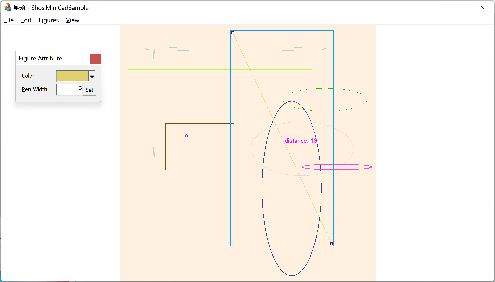

# [C++/MFC] Shos.MiniCadSample

Sample of simple CAD.

* Functions
    * Figures
        * Dot
        * Line segment
        * Rectangle
        * Ellipse
        * Random
	* Command
        * Figure selection
            * Single Figure selection
            * Multi Figure selection
        * Command switching
        * Dragging input and Clicking input
        * Undo / Redo
        * Rubberband
    * View
        * Double Buffering
        * Scroll View
	    * View to fit window size
	    * Zoom View
    * Modeless Dialog
    * Serialization
    * Clipboard operation
        * Copy to:
          Extended metafiles, bitmaps, and custom format
        * Paste from:
          Custom format
	* class design
    	* Separation of model and view
        * Notification by Observer Pattern
		
* Development & Execution Environment
    * Language: C++
    * Framework: MFC
    * OS: Windows
